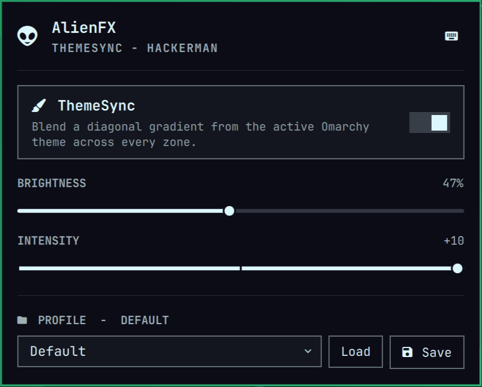
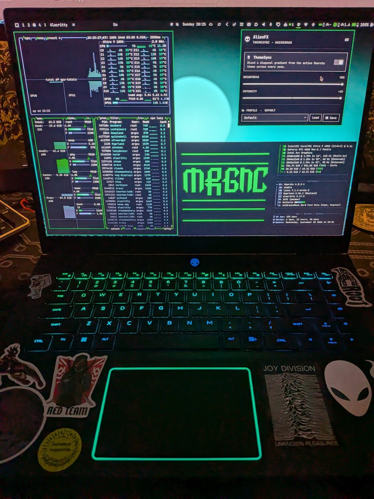
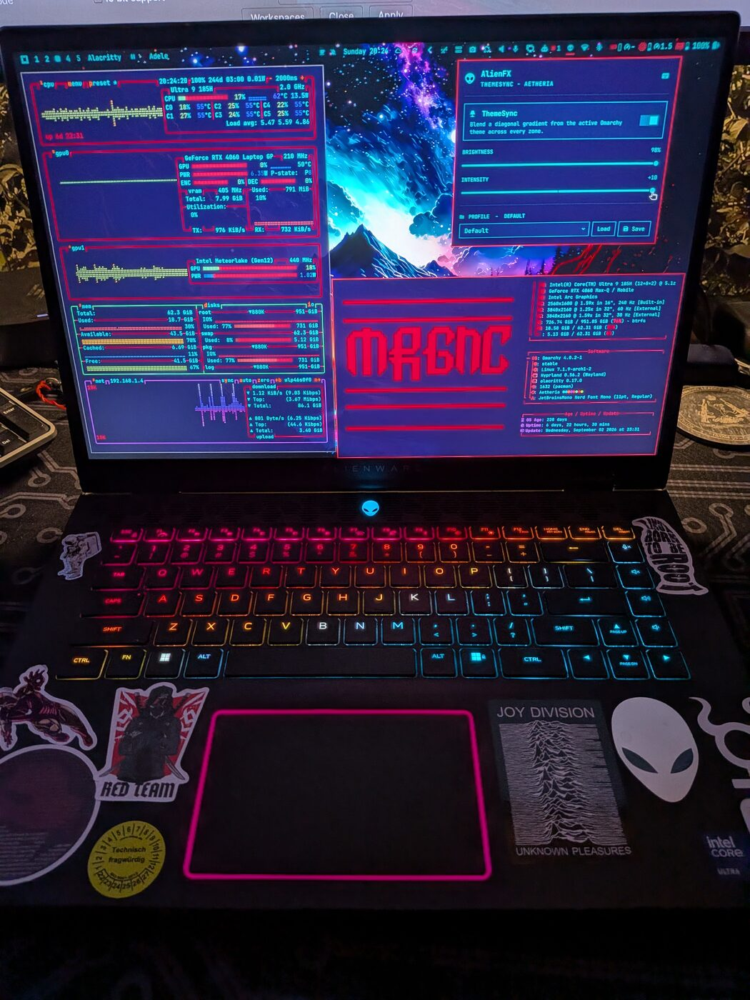

# omarchy-alienfx-plugin

RGB lighting control for Alienware laptops, as a native [Omarchy](https://omarchy.org/)
4.0+ Quickshell plugin.

An alien head sits on the bar. Click it for a popup built from Omarchy's own components,
so it follows your theme. By default it blends a diagonal gradient from the active theme's
palette across the keyboard and the chassis zones, and repaints when you switch themes.

Runs unprivileged. No `sudo`, no root daemon.

## Which laptops

Tested on my Alienware m16 R2. Everything else is work in progress and help
is welcome.

Most of the plugin is already model independent. The lighting protocol should be the same across
Alienware machines, controllers are found by USB vendor and HID report shape rather than a
hard-coded product id, chassis zones come from a per-model file, and laptops that light the
keyboard as four zones instead of per key are supported.

What differs between machines is which LED belongs to which key, and that can't be worked
out using the keymap wizard. LED numbering follows the circuit board, not the keyboard: for example, on the tested machine the `backspace` key is indexed as 34 where the obvious pattern expects 33, and the left arrow is 133 where an assumed prediction may come out at 113.

So the plugin cli component does not try to guess, predict, or assume the layout of other models. Instead there's a wizard. It lights one LED at a time and you walk it onto the right key
with the arrow keys, figuring out the next key and learning from your corrections. In this way it should only take 3 to 5 minutes of walking the keys and saving the positions, and your machine is mapped.

If you own a different AlienFX laptop, please send the keymap back. Adding a model is a
data change with no code behind it and I can include these in the plugin's default collection if other users want to contribute them. See [CONTRIBUTING.md](CONTRIBUTING.md).

## What it controls on my laptop and should be able to controll on similar hardware too

| Zone | Hardware |
|---|---|
| Keyboard | per-key RGB, 85 keys on the reference machine |
| Touchpad | the halo around it |
| Lid logo | the alien head |
| Power button | the alien head on the button |

## Install

### From GitHub

```bash
omarchy plugin add https://github.com/3mrgnc3/omarchy-alienfx-plugin.git --enable
```

This installs only the QML, so on first run a popup will offer **Complete setup** on first click. This installs the udev rule, the CLI tool and the systemd units that live outside the plugin folder. The Complete setup process opens a terminal, checks dependencies, tells you what's missing and asks before changing
anything. The udev step needs your password once. This project codebase is small, and users can quickly and easily verify it before install. 




### Themesync mode on Hackerman Theme



### Themesync mode on Atheria Theme



## Example of the wizard menu interface

```bash
================================================================
 AlienFX KeyMap Wizard
================================================================

A keymap records which LED belongs to which key, where that key sits,
and which chassis zones this machine has. Layouts differ between
models and regions, so each machine keeps its own.

  Machine  : Alienware m16 R2 (sku 0C91, BIOS 1.19.0)
  Keymaps  : /home/mrgnc/.config/omarchy-alienfx-plugin/keymap
  Expected : alienware-m16-r2-keymap.json
  Installed: Alienware m16 R2: 85 keys mapped, 3 chassis zones (logo, pbtn, tpd)
             /home/mrgnc/.config/omarchy-alienfx-plugin/keymap/alienware-m16-r2-keymap.json

  1. Load Existing KeyMap File
  2. Create New KeyMap
  3. Exit

Choose [1-3]:

```


### From a clone

```bash
git clone https://github.com/3mrgnc3/omarchy-alienfx-plugin
cd omarchy-alienfx-plugin
./install.sh
```

`--yes` installs missing dependencies without asking, `--no-deps` reports them and carries
on. The installer is idempotent, so re-run it to upgrade in place.

It sets up:

- `~/.local/bin/alienfx-ctl` and its package in `~/.local/share/omarchy-alienfx-plugin/`
- `/etc/udev/rules.d/60-omarchy-alienfx.rules`, the one step needing root
- the plugin in `~/.config/omarchy/plugins/3mrgnc3.alienfx/`, enabled on the bar
- a `theme-set` hook, so theme switches repaint the lights
- systemd user units that restore lighting at login and after suspend

### Dependencies

| | Package | Why |
|---|---|---|
| Required | `python` | 3.11+, `tomllib` reads theme palettes |
| Recommended | `ttf-jetbrains-mono-nerd` | or the alien head renders as a blank box |
| Recommended | `alacritty` | a terminal for the KeyMap Wizard |
| Optional | `gum` | nicer installer prompts |

Omarchy itself, systemd, and `sudo` or `pkexec` for the udev step are also required.
Missing packages are installed with `omarchy pkg add`, falling back to `pacman`.

### Uninstall

```bash
./uninstall.sh
omarchy plugin remove 3mrgnc3.alienfx
```

Run `uninstall.sh` first. `omarchy plugin remove` deletes the plugin folder, which is all
Omarchy knows about, and the script lives in it.


## CLI

Everything the popup does is available by hand, which makes it debuggable without the
shell running.


The plugin controls the independant alienfx-cli tool that can also be used in a standalone way.

```bash
~ ❯ alienfx-ctl -h
usage: alienfx-ctl [-h] [--version] {state,set,solid,off,effect,theme,themesync,zonesync,stream,commit,restore,profile,keymap,devices} ...

Control the RGB lighting zones on a supported Alienware laptop.

positional arguments:
  {state,set,solid,off,effect,theme,themesync,zonesync,stream,commit,restore,profile,keymap,devices}
    state               show current state
    set                 change settings and apply (the plugin's entry point)
    solid               set a flat colour
    off                 turn zones off
    effect              run an effect
    theme               theme palette sync
    themesync           turn theme syncing on or off
    zonesync            control all zones together or individually
    stream              read commands from stdin with the devices held open
    commit              re-apply state durably (programs power-button NVRAM)
    restore             re-apply saved state (login/resume)
    profile             named profiles
    keymap              per-key keymap management
    devices             show detected controllers and access

options:
  -h, --help            show this help message and exit
  --version             show program's version number and exit
```

Colours accept `RRGGBB`, `#RRGGBB`, `r,g,b`, a name, or `@themekey` to pull from the active
palette. Brightness accepts `0-255` or `10%`. Add `--persist` to write chassis colours into
NVRAM so they survive a cold boot.

## Why no `sudo`

The udev rule tags both HID nodes with `uaccess`, so logind grants the seat owner an ACL on
login. The CLI opens them as you.

The rule is numbered `60-` on purpose. `uaccess` is applied by a builtin that runs from
`73-seat-late.rules`, so a rule numbered above that is read too late and the tag is never
seen. An earlier version of this project spent a long time chasing what looked like a
boot-time race and was only ever a filename.

Nodes are resolved at runtime by vendor id and HID report shape, never by a fixed
`/dev/hidrawN`. On this laptop `hidraw0` is sometimes a security key.

## Other machines

The machine identifies itself from DMI and its keymap is stored per model, so a config
directory can move between machines without them fighting over one file.

Zones come from the keymap rather than a constant:

```json
"zones": { "tpd": [0], "logo": [2], "pbtn": [4] }
```

Any names work, and the order they're listed in is the order the gradient travels through
them. A keyboard lit as four zones rather than per key declares `"keyboard": "zones"` and
lists them the same way.

A keymap contributed for your model, bundled in `cli/src/alienfx_ctl/data/`, is used ahead
of the reference one. Your own probed keymap always wins over a bundled one.

`alienfx-ctl keymap gaps` reports LED indices the keymap doesn't name and flags those next
to a named key. Reach for it first if a single key behaves oddly.

## Known limits

- **The power button takes the slow path.** Ordinary colour commands are overridden by the
  firmware's power-state handler, so a colour only sticks by programming six NVRAM blocks.
  That's done, and the zone shows your colour on AC and battery, breathes while charging
  and fades going to sleep, while still warning in red when the battery is critical. It
  costs about 2.3s, so it's skipped during a live drag and when NVRAM already matches.
- **Chassis zones can't animate.** They're single-LED zones. Wave, Pulse and Nightrider are
  keyboard effects and the chassis holds the base colour.
- **Brightness is colour.** Neither controller exposes a brightness field on these paths, so
  brightness scales the RGB channels. At 10% a saturated colour is a dim ember.
- Effects that don't render usefully on the reference BIOS, such as hardware pulse, dual
  wave and laser, aren't offered rather than exposed and broken.

## Layout

```
manifest.json  Panel.qml  Model.js     the Quickshell plugin
cli/src/alienfx_ctl/                   the CLI
cli/src/alienfx_ctl/data/              reference keymap and keyboard shapes
cli/tests/                             551 tests, no hardware required
share/udev/                            the uaccess rule
share/systemd/                         restore and resume units
share/omarchy/hooks/theme-set.d/       the theme-switch hook
share/bin/                             the wizard's terminal launcher
```

Earlier versions of this tool, and a long note on things that didn't work, are on the
`archive-reference` branch rather than `main`, to keep them out of every clone. That note is
worth reading before changing the hardware layer: it records failures that cost real time,
including two that brick the keyboard until you reboot.

```bash
git fetch origin archive-reference
git checkout archive-reference -- archive/ docs/dead-ends.md
```

## Development

Checks run locally. There's no CI and no GitHub Actions.

```bash
cd cli && python3 -m pytest tests -q     # 551 tests, no hardware needed
```

That covers the protocol buffers, the gradient maths, the wizard, and the packaging checks:
the manifest against what Omarchy's plugin registry enforces, declared settings against the
ones the QML reads, the bundled layouts, and the shell scripts parsing.

## Licence

MIT. See [LICENSE](LICENSE).


[def]: images/default-mode-01.png